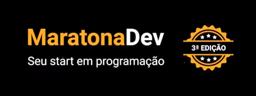

 # Doe Sangue

### A sua doação importa!
#### Formulário que recebe o cadastro de um doador e informa os últimos doadores na tela.

### :rocket: MaratonaDev - Rockeseat
  
Realizado entre o dia 17/02/2020 até 19/02/2020 
Instrutor: Mayk Brito

### Tecnologias utilizados no projeto

#### Front-end 
* [javascript](https://developer.mozilla.org/pt-BR/docs/Web/JavaScript)
* [html](https://developer.mozilla.org/pt-BR/docs/Web/HTML)
* [css](https://developer.mozilla.org/pt-BR/docs/Web/CSS)

#### Back-end 
* [node.js](https://nodejs.org/pt-br/docs/) 
* [express](https://expressjs.com/pt-br/starter/installing.html)
* [nodemon](https://github.com/remy/nodemon#nodemon)
* [node-postgres](https://node-postgres.com/)
* [nunjucks](https://mozilla.github.io/nunjucks/templating.html)
* [PostgreSQL](https://www.postgresql.org/)

### :girl: Laylinha
Ajustes do README, feito pelo meu pai! 
Primeiro projeto "html, css e javascript" da minha vida, tenho 13 anos na data desse projeto.
